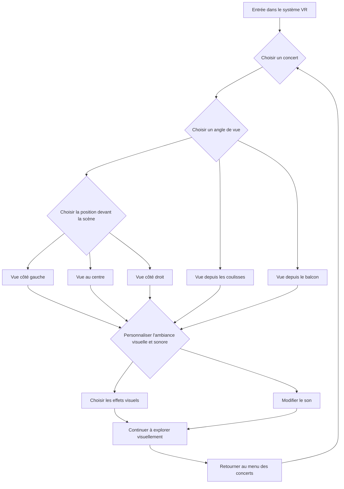

# Concert interactif en réalité virtuelle

## Concept central

Une expérience de concert immersive et interactive en réalité virtuelle où les utilisateurs peuvent assister à des performances musicales en temps réel. Les billets pour ces concerts sont vendus sous forme de "billets virtuels" à un coût inférieur à celui des concerts physiques.

## Objectifs

- Permettre aux utilisateurs de vivre des concerts en direct depuis n'importe quel endroit avec une immersion totale.
- Offrir une personnalisation complète de l'expérience de concert (angle de vue, ambiance, etc.).
- Proposer une alternative économique et accessible aux concerts physiques, avec des billets virtuels moins coûteux.
- Créer un environnement interactif où les utilisateurs peuvent interagir avec les artistes virtuels et entre eux tel une zone de clavardage.

## Motivations

- Réinventer l’expérience du concert, en la rendant plus accessible et adaptable aux préférences personnelles de chaque spectateur.
- Utiliser les avantages de la VR pour offrir un niveau de personnalisation impossible dans un concert traditionnel.
- Permettre aux artistes de toucher un public mondial sans les contraintes logistiques des tournées.

## Scénario interactif

### Logigramme Mermaid

Voici un schéma de l’interaction des utilisateurs avec le concert en VR :

L’utilisateur entre dans un espace de concert virtuel où il peut choisir son emplacement dans la salle (face à la scène, sur scène, au balcon, etc.). Il peut interagir avec l’environnement, choisir différents effets visuels (par exemple, des jeux de lumières ou des filtres de réalité augmentée), et même personnaliser le son (plus de basses, écho, mix audio différent).

## Technologies nécessaires

### Support médiatique

| Élément               | Description                                                                 | Exemples             |
| --------------------- | --------------------------------------------------------------------------- | -------------------- |
| Captation vidéo/audio | Captation vidéo et audio en temps réel des performances, intégration en VR. | Caméras 360°, micros |

### Matériel

| Élément        | Description                                                                      | Exemples                   |
| -------------- | -------------------------------------------------------------------------------- | -------------------------- |
| Casques VR     | Appareils permettant une immersion totale dans l’univers du concert.             | Oculus Quest, HTC Vive     |
| Contrôleurs VR | Permettent aux utilisateurs de modifier l’environnement.                         | Oculus Touch               |
| Serveurs       | Nécessaires pour gérer la diffusion en direct et les interactions en temps réel. | Serveurs haute performance |

### Logiciels

| Élément                 | Description                                                          | Exemples                         |
| ----------------------- | -------------------------------------------------------------------- | -------------------------------- |
| Développement 3D        | Création et gestion de l’espace interactif du concert.               | Unreal Engine, Unity             |
| Personnalisation sonore | Permet aux utilisateurs de modifier l’ambiance sonore en temps réel. | Plugins audio, spatialisation 3D |

### Billetterie virtuelle

| Élément            | Description                                                                                  | Exemples                                           |
| ------------------ | -------------------------------------------------------------------------------------------- | -------------------------------------------------- |
| Système de tickets | Gestion des achats de billets virtuels pour l’accès au concert.                              | Plateformes de vente en ligne, NFT                 |
| Accès premium      | Options de billets avec accès à des fonctionnalités exclusives (vue spéciale, interactions). | Portails web, accès exclusifs via l'application VR |

## Ambiance

- **Planche visuelle** : Design inspiré des concerts futuristes avec des jeux de lumières personnalisables, des effets visuels projetés sur scène (néons, lasers, effets holographiques). Palette de couleurs fluide et ajustable selon les préférences des utilisateurs.
- **Planche sonore** : Sons en 3D spatialisés pour que l'utilisateur puisse se sentir au cœur de l'expérience sonore, avec des options pour personnaliser les basses, les aigus ou ajouter des effets comme des échos.
