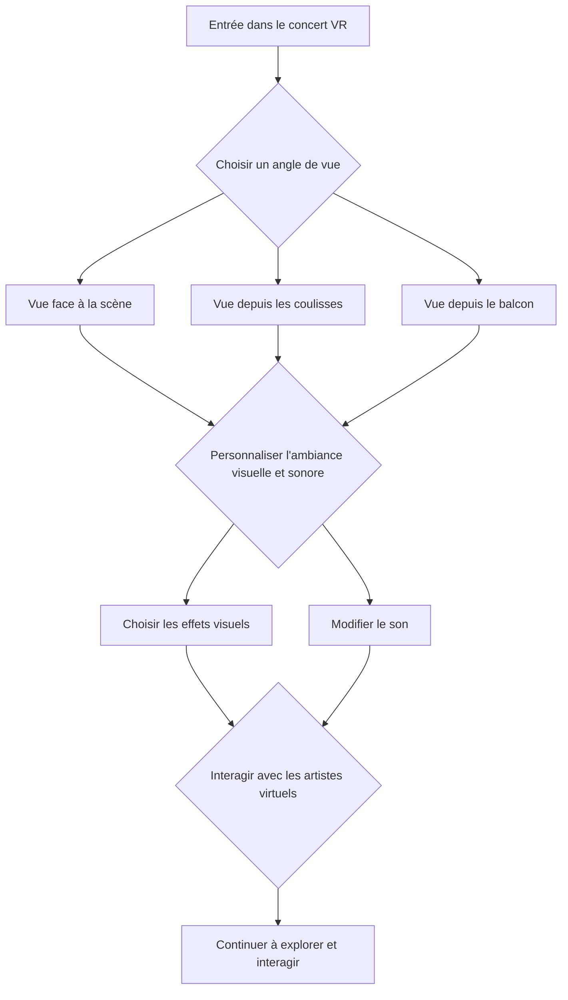

# Projet : Concert interactif en réalité virtuelle (VR)

## Concept central

Créer une expérience de concert immersive et interactive en réalité virtuelle où les utilisateurs peuvent assister à des performances musicales en temps réel. Chaque utilisateur peut personnaliser son expérience en choisissant l’angle de vue, en modifiant l’ambiance visuelle et sonore, et en interagissant avec les artistes virtuels. Les billets pour ces concerts sont vendus sous forme de "billets virtuels" à un coût inférieur à celui des concerts physiques.

## Objectifs

- Permettre aux utilisateurs de vivre des concerts en direct depuis n'importe quel endroit avec une immersion totale.
- Offrir une personnalisation complète de l'expérience de concert (angle de vue, ambiance, etc.).
- Proposer une alternative économique et accessible aux concerts physiques, avec des billets virtuels moins coûteux.
- Créer un environnement interactif où les utilisateurs peuvent interagir avec les artistes virtuels et entre eux.

## Motivations

- Réinventer l’expérience du concert, en la rendant plus accessible et adaptable aux préférences personnelles de chaque spectateur.
- Utiliser les avantages de la VR pour offrir un niveau de personnalisation impossible dans un concert traditionnel.
- Permettre aux artistes de toucher un public mondial sans les contraintes logistiques des tournées.

## Scénario interactif

L’utilisateur entre dans un espace de concert virtuel où il peut choisir son emplacement dans la salle (face à la scène, sur scène, au balcon, etc.). Il peut interagir avec l’environnement, choisir différents effets visuels (par exemple, des jeux de lumières ou des filtres de réalité augmentée), et même personnaliser le son (plus de basses, écho, mix audio différent).

Des options permettent également d’interagir avec les avatars virtuels des artistes, comme lancer des animations ou déclencher des effets scéniques. Le concert est diffusé en direct, mais chaque spectateur vit une version légèrement différente en fonction de ses choix de personnalisation.

## Structure interactive

- **Choix de l'angle de vue** : L’utilisateur peut naviguer librement dans l’espace du concert et choisir où se positionner virtuellement (vue frontale, vue côté scène, même vue depuis les coulisses).
- **Personnalisation de l’ambiance** : Via un menu VR, l’utilisateur peut sélectionner les effets visuels (couleurs des lumières, projections) et sonores (ajouter des réverbérations, modifier le mix audio).
- **Interactions avec les artistes virtuels** : Les avatars des artistes réagissent à certaines actions du public, comme des acclamations ou des gestes avec les contrôleurs VR.

## Technologies nécessaires

- **Support médiatique** : Captation vidéo et audio en temps réel des performances, intégration en VR via **Unreal Engine** ou **Unity**.
- **Matériel** : Casques VR (comme l’Oculus Quest ou le HTC Vive) pour l’immersion totale. Les utilisateurs doivent aussi posséder des contrôleurs VR pour interagir avec l’environnement et les artistes.
- **Logiciels** : Unreal Engine ou Unity pour développer l’espace du concert en 3D et gérer les interactions. Utilisation de **plugins audio** pour la personnalisation sonore en temps réel et de **systèmes de projection** pour les effets visuels.

## Ambiance

- **Planche visuelle** : Design inspiré des concerts futuristes avec des jeux de lumières personnalisables, des effets visuels projetés sur scène (néons, lasers, effets holographiques). Palette de couleurs fluide et ajustable selon les préférences des utilisateurs.
- **Planche sonore** : Sons en 3D spatialisés pour que l'utilisateur puisse se sentir au cœur de l'expérience sonore, avec des options pour personnaliser les basses, les aigus ou ajouter des effets comme des échos.

## Logigramme Mermaid

Voici un schéma de l’interaction des utilisateurs avec le concert en VR :

